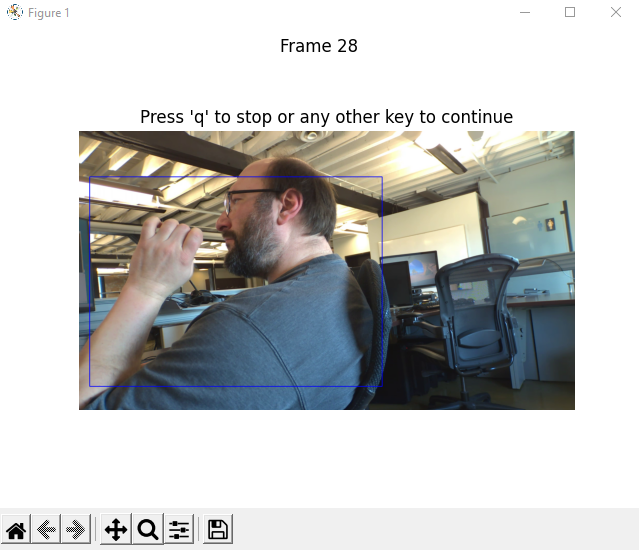

## Introduction
This Python app allows user to parse MCAP files and view each H.264 frame using Matplotlib.  It also allows the user to overlay the bounding boxes from the detection topic (in blue) onto the frame. Furthermore, the app also has a feature to feed it an ONNX model which can inference the frame and overlay those bounding boxes (in red) onto the frame.

This application has been tested on Python 3.10.11 on Windows 10 and Python 3.10.12 on WSL, Ubuntu 22.04.

## Installation

### Install Ubuntu 22.04 packages
The following libraries must be installed as part of the Ubuntu environment using the following command:
```bash
sudo apt-get install python3-tk
sudo apt-get install build-essential
sudo apt-get install libxcb-xinerama0
sudo apt-get install qtbase5-dev
```
### Install Python Dependencies
Python library requirements must be installed via Pip:
```bash
pip install -r requirements.txt
``` 

## Run the Script
The script can be run simply with:
```bash
python viewer.py <mcap_file>
``` 
The MCAP file must have the following topics included:
* /camera/h264
* /camera/info
* /model/boxes2d

If the MCAP file does not include these topics, it will generate an error:
```bash
$ python viewer.py no_model_boxes2d.mcap
INFO:__main__:Opening no_model_boxes2d.mcap
INFO:__main__:Found topic /camera/info
INFO:__main__:Found topic /camera/h264
ERROR:__main__:Did not find topic /model/boxes2d
ERROR:__main__:Cannot view no_model_boxes2d.mcap without topic /model/boxes2d.  Exiting
```
Otherwise, a successful run should generate the popup,  
  
and the following messages:
```bash
$ python .\viewer.py .\test.mcap   
INFO:__main__:Opening .\test.mcap
INFO:__main__:Found topic /camera/info
INFO:__main__:Found topic /camera/h264
INFO:__main__:Found topic /model/boxes2d
INFO:__main__:Found 2 boxes at time 595861.36261
INFO:__main__:Showing Frame 23
INFO:__main__:Found 2 boxes at time 595861.418251
INFO:__main__:Showing Frame 24
INFO:__main__:Found 1 boxes at time 595861.485368
INFO:__main__:Showing Frame 26
INFO:__main__:Found 1 boxes at time 595861.551772
INFO:__main__:Showing Frame 28
```

To remove the MCAP bounding boxes, run the command with the -b option:
```bash
python viewer.py -b <mcap_file>
``` 
To view the bounding boxes of an ONNX model, include the model with -m option:
```bash
python viewer.py -b -m <ONNX_model> <mcap_file>
```
Both sets of bounding boxes can be combined:
```bash
python viewer.py -m <ONNX_model> -b <mcap_file>
```

## License
This project is licensed under the AGPL-3.0 or under the terms of the DeepView AI Middleware Commercial License.

## Support
Commercial Support is provided by Au-Zone Technologies through the [DeepView Support](https://support.deepviewml.com) site.
